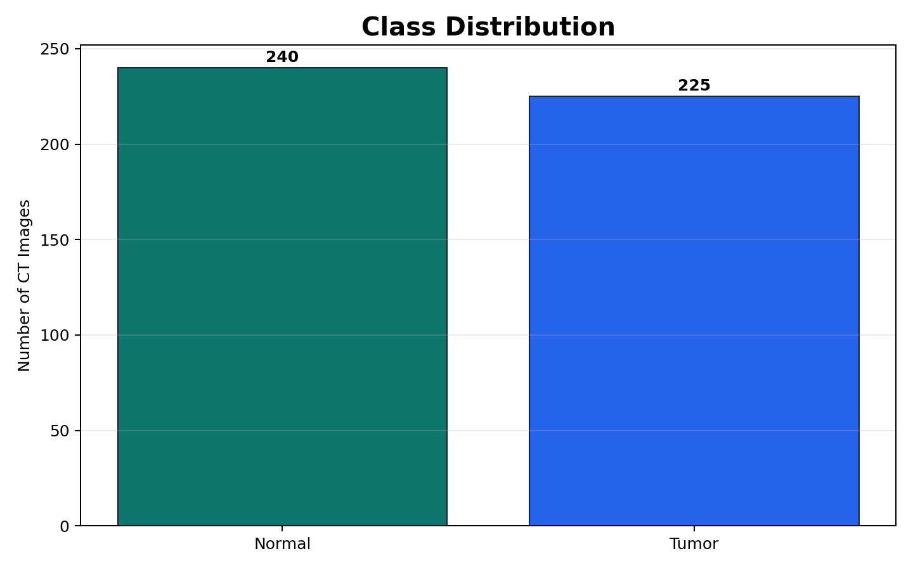
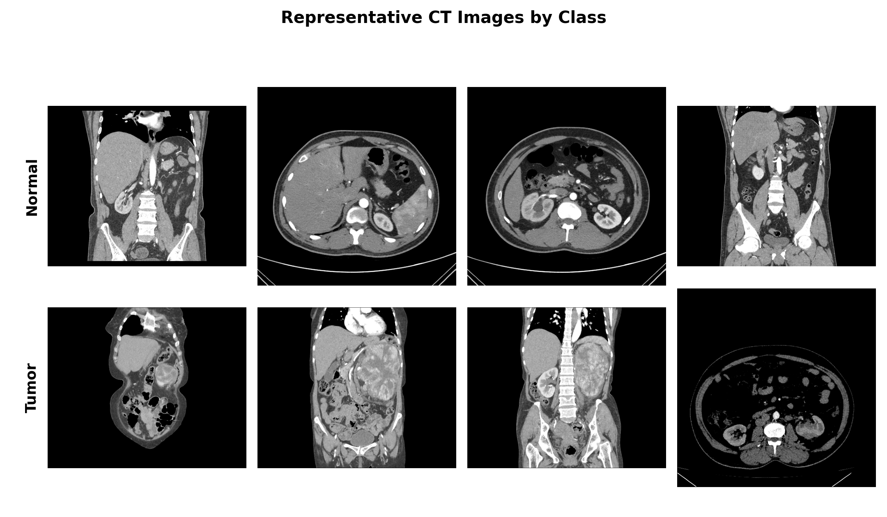
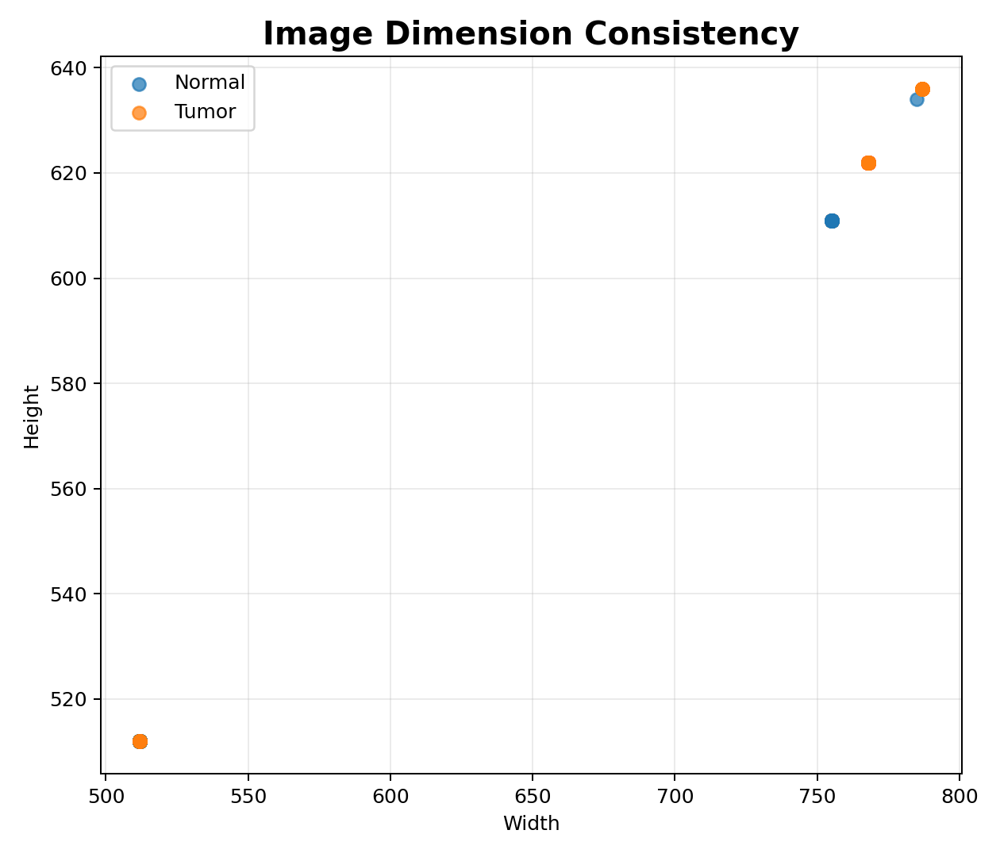
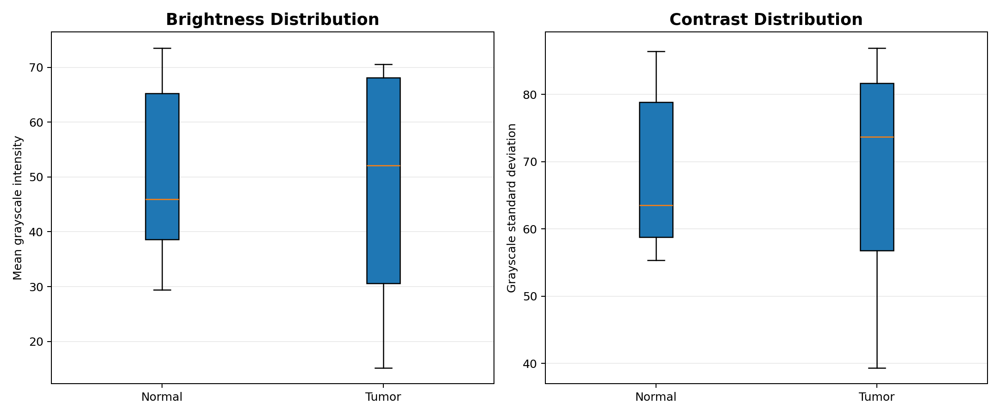
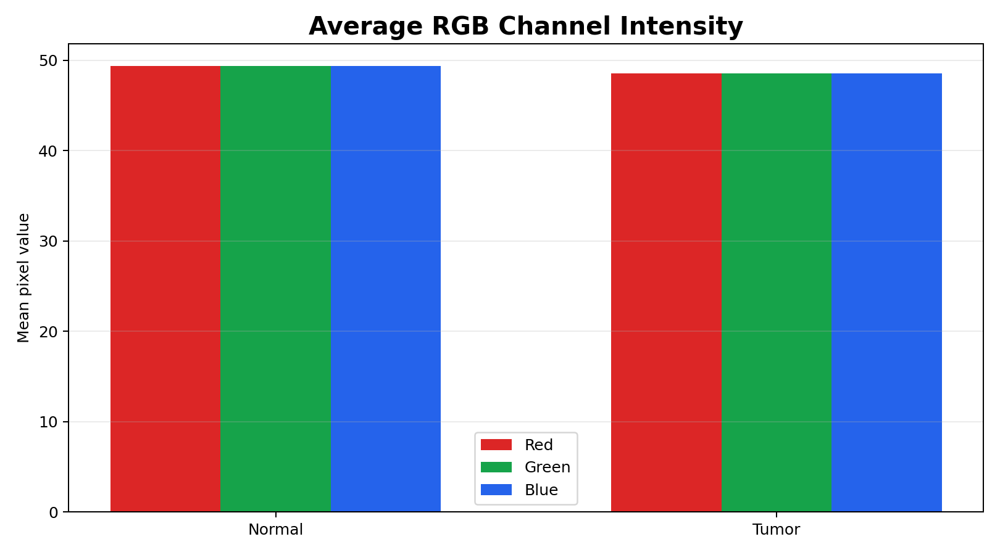
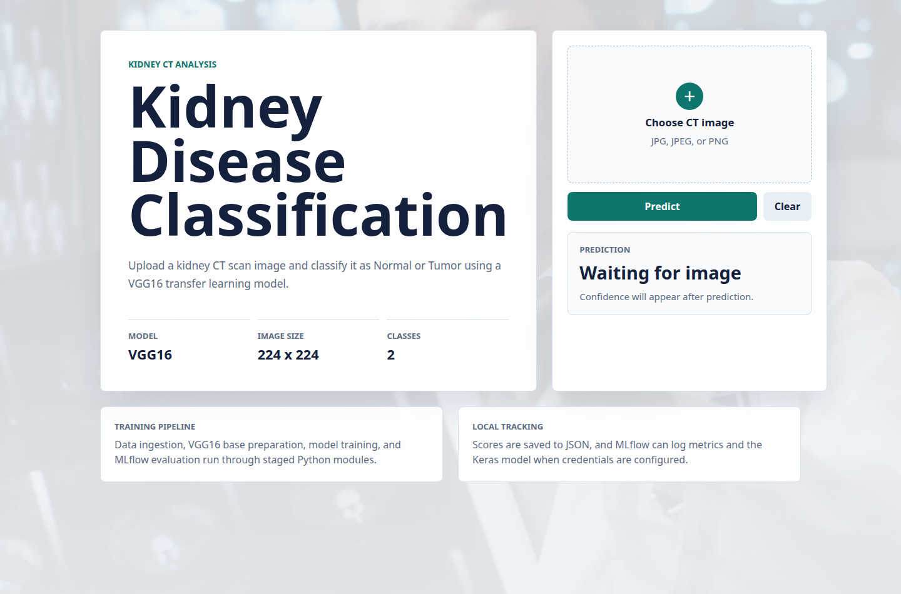

# Kidney Disease Classification

Kidney Disease Classification is a deep learning project for classifying kidney CT scan images as **Normal** or **Tumor**. The project uses a VGG16 transfer-learning model, a staged training pipeline, YAML-based configuration, MLflow experiment logging, and a Flask interface for image prediction.

The focus is a reproducible machine learning workflow: dataset ingestion, exploratory data analysis, model training, evaluation, and local inference.

## Highlights

- VGG16 feature extractor with ImageNet weights
- Keras `ImageDataGenerator` training pipeline
- Reproducible configuration through `config/config.yaml` and `params.yaml`
- MLflow logging for parameters, metrics, and model artifacts
- DVC pipeline file for local orchestration
- Flask frontend for CT image upload and prediction
- Real EDA figures generated from the downloaded dataset

## Dataset

The dataset is downloaded from a public Google Drive archive:

```text
https://drive.google.com/file/d/1vlhZ5c7abUKF8xXERIw6m9Te8fW7ohw3/view?usp=sharing
```

After extraction, images are stored at:

```text
artifacts/data_ingestion/kidney-ct-scan-image
```

The extracted dataset contains **465 CT images** across two folders:

| Class | Images |
| --- | ---: |
| Normal | 240 |
| Tumor | 225 |
| **Total** | **465** |

## Exploratory Data Analysis

EDA figures are generated from the actual extracted CT images using `scripts/eda.py`.

### Class Balance

The dataset is close to balanced, with only a small difference between the Normal and Tumor classes.



### CT Image Samples

The sample grid below shows real images from both classes. It is useful for visually checking image quality, framing, contrast, and class-level appearance before training.



### Image Dimensions

The original images are not all the same size. Widths range from **512 to 787 pixels**, and heights range from **512 to 636 pixels**. The training pipeline standardizes them to `224x224`.



### Brightness and Contrast

The class-level brightness values are very close: Normal images average **49.37**, while Tumor images average **48.55** on the grayscale intensity scale. This suggests the classifier should not rely on a simple brightness shortcut.



### RGB Channel Statistics

The channel means provide a quick check of dataset color intensity. These CT images are visually grayscale-like, so RGB channel behavior is expected to be similar across channels.



## Model

The classifier follows a transfer-learning approach:

1. Load VGG16 with `imagenet` weights and `include_top=False`.
2. Freeze the convolutional base.
3. Add a `Flatten` layer.
4. Add a `Dense` output layer with 2 softmax units.
5. Train using categorical cross-entropy and SGD.

Default parameters:

```yaml
AUGMENTATION: True
IMAGE_SIZE: [224, 224, 3]
BATCH_SIZE: 16
INCLUDE_TOP: False
EPOCHS: 1
CLASSES: 2
WEIGHTS: imagenet
LEARNING_RATE: 0.01
```

## Training Pipeline

The pipeline is organized into four stages:

| Stage | Purpose |
| --- | --- |
| Data ingestion | Download and extract the CT image dataset |
| Base model preparation | Create the VGG16 base and updated classifier model |
| Training | Train the updated model on the CT image folders |
| Evaluation | Save metrics and log the model with MLflow |

Run the full pipeline:

```bash
uv run python main.py
```

Run through DVC:

```bash
uv run dvc repro
```

Generate EDA figures:

```bash
uv run python scripts/eda.py
```

## MLflow Evaluation

Evaluation writes metrics to:

```text
scores.json
```

The evaluation stage logs:

- model parameters from `params.yaml`
- validation loss
- validation accuracy
- Keras model artifact

The MLflow tracking URI is configured in `config/config.yaml`. Remote tracking requires valid DagsHub or MLflow credentials in the environment.

## Web Application

The Flask app provides a local prediction interface for CT images.



Routes:

| Route | Method | Description |
| --- | --- | --- |
| `/` | GET | Upload interface |
| `/predict` | POST | Image prediction endpoint |
| `/train` | GET, POST | Runs the training pipeline |

Prediction mapping:

| Output Index | Label |
| ---: | --- |
| 0 | Normal |
| 1 | Tumor |

The predictor expects the trained model at:

```text
artifacts/training/model.h5
```

## Project Structure

```text
.
├── app.py
├── main.py
├── pyproject.toml
├── dvc.yaml
├── config/
│   └── config.yaml
├── params.yaml
├── scripts/
│   └── eda.py
├── assets/
│   └── eda/
├── artifacts/
├── data/
│   ├── raw/
│   └── processed/
├── notebooks/
├── prediction_test_file/
├── static/
│   ├── css/
│   └── js/
├── templates/
└── src/
    └── kidney_classifier/
        ├── components/
        ├── configuration/
        ├── constants/
        ├── entity/
        ├── pipeline/
        └── utils/
```

## Setup

Install dependencies with `uv`:

```bash
uv sync
```

Download and extract the dataset:

```bash
uv run python -c "from kidney_classifier.pipeline.stage_01_data_ingestion import DataIngestionTrainingPipeline; DataIngestionTrainingPipeline().main()"
```

Generate the EDA images:

```bash
uv run python scripts/eda.py
```

Train and evaluate:

```bash
uv run python main.py
```

Start the Flask app:

```bash
uv run python app.py
```

Open:

```text
http://localhost:8080
```

## Notes

This project is intended for machine learning experimentation and is not a clinical diagnostic tool.
