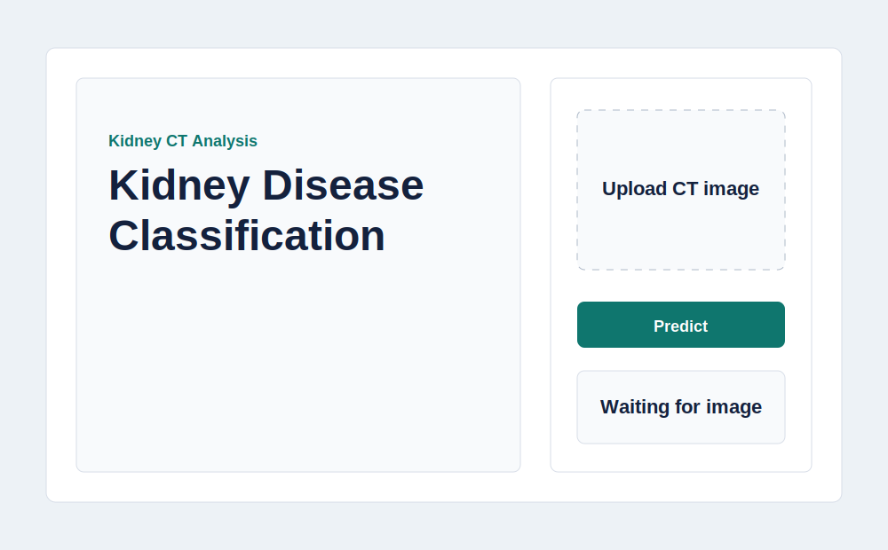
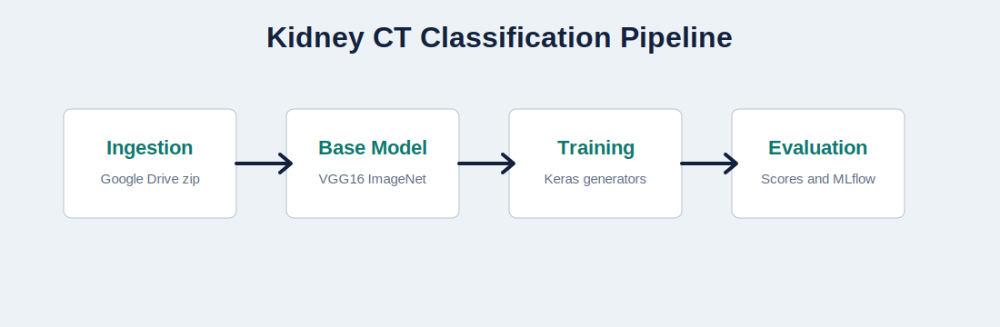
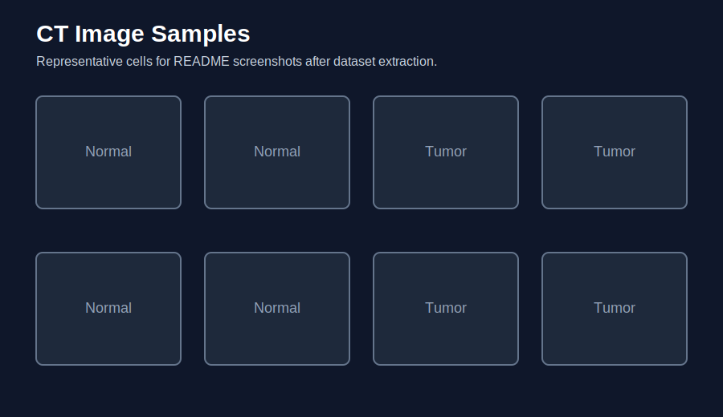
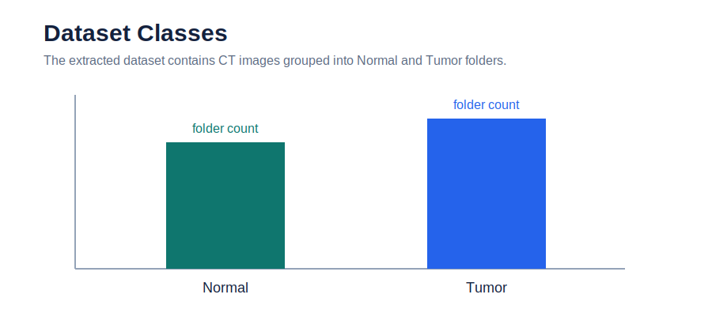
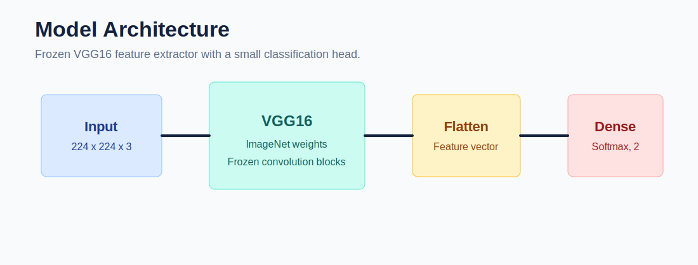
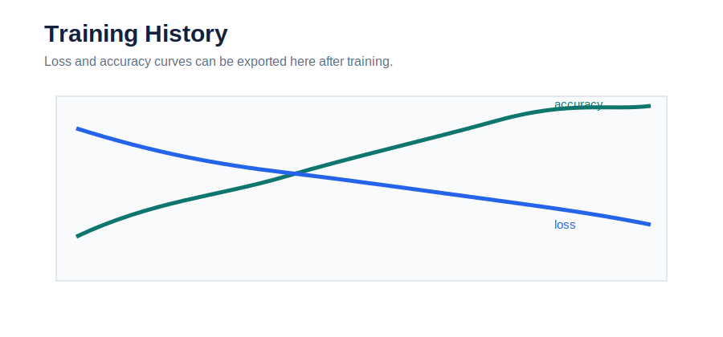
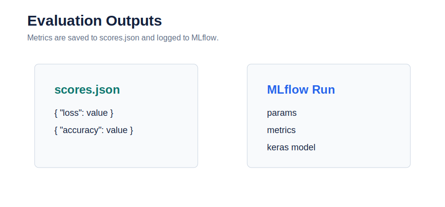
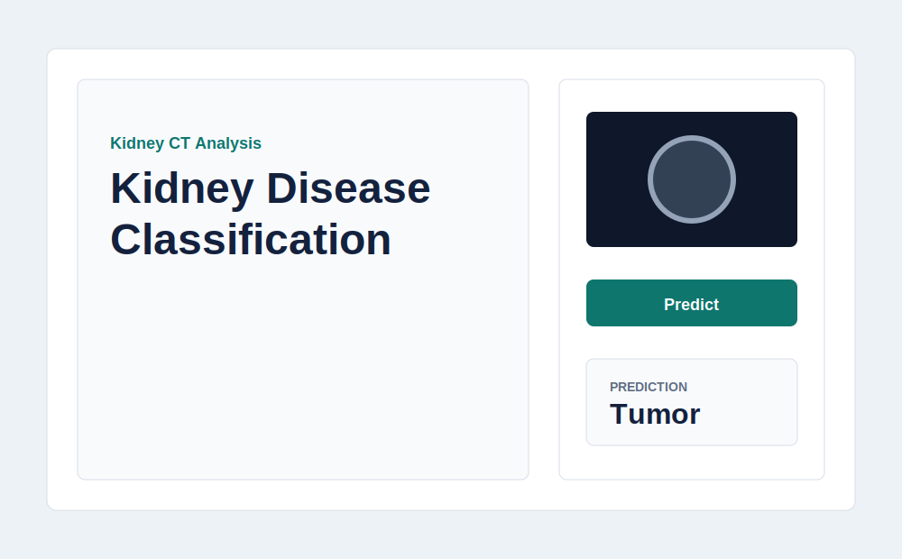

# Kidney Disease Classification with VGG16

This project classifies kidney CT scan images into two categories: **Normal** and **Tumor**. It uses a VGG16 transfer-learning model, a staged training pipeline, YAML configuration, local logging, MLflow evaluation tracking, and a Flask web interface for image prediction.

The project is designed as a clean machine learning application rather than a deployment exercise. It keeps the model, pipeline, frontend, and documentation together while leaving out Docker, cloud setup, and CI/CD.



## Project Workflow



The pipeline has four main stages:

1. **Data ingestion** downloads the kidney CT dataset from Google Drive using `gdown` and extracts it into `artifacts/data_ingestion/`.
2. **Base model preparation** loads VGG16 with ImageNet weights and saves the frozen base model.
3. **Training** adds a flatten layer and a softmax classifier head, then trains the model using Keras image generators.
4. **Evaluation** measures validation loss and accuracy, saves `scores.json`, and logs parameters, metrics, and the Keras model to MLflow.

## Dataset

The dataset is downloaded from the original Google Drive source:

```text
https://drive.google.com/file/d/1vlhZ5c7abUKF8xXERIw6m9Te8fW7ohw3/view?usp=sharing
```

After extraction, the expected dataset folder is:

```text
artifacts/data_ingestion/kidney-ct-scan-image
```

The directory should contain class folders for CT images.





## Model

The model uses the same transfer-learning approach as the reference project:

- VGG16 backbone
- ImageNet weights
- `include_top=False`
- frozen convolutional layers
- `Flatten`
- `Dense(units=2, activation="softmax")`
- SGD optimizer
- categorical cross-entropy loss
- accuracy metric



Default training parameters are stored in `params.yaml`:

```yaml
AUGMENTATION: True
IMAGE_SIZE: [224, 224, 3]
BATCH_SIZE: 16
INCLUDE_TOP: False
EPOCHS: 1
CLASSES: 2
WEIGHTS: imagenet
LEARNING_RATE: 0.01
```

## Training

The training step uses `ImageDataGenerator` with:

- pixel rescaling by `1./255`
- validation split of `0.20`
- bilinear resizing to `224x224`
- rotation, horizontal flip, shifts, shear, and zoom when augmentation is enabled

Run the full pipeline:

```bash
uv run python main.py
```

Run the DVC pipeline locally:

```bash
uv run dvc repro
```



## Evaluation and MLflow

Evaluation uses a validation split of `0.30` and writes:

```text
scores.json
```

The MLflow stage logs:

- training parameters
- validation loss
- validation accuracy
- Keras model artifact

The MLflow tracking URI is configured for the same DagsHub endpoint used by the reference project. Remote logging requires valid MLflow/DagsHub credentials in the environment.



## Web App

The Flask app provides a custom frontend for prediction. It accepts a CT image, previews it, sends the image to `/predict`, and displays the predicted class and confidence.



Routes:

| Route | Method | Purpose |
| --- | --- | --- |
| `/` | GET | Web interface |
| `/predict` | POST | Predict uploaded CT image |
| `/train` | GET, POST | Run the training pipeline |

Prediction labels:

| Model Output | Label |
| --- | --- |
| `0` | Normal |
| `1` | Tumor |

## Project Structure

```text
.
├── app.py
├── main.py
├── pyproject.toml
├── dvc.yaml
├── config/
│   └── config.yaml
├── params.yaml
├── assets/
├── artifacts/
├── data/
│   ├── raw/
│   └── processed/
├── notebooks/
├── prediction_test_file/
├── static/
│   ├── css/
│   └── js/
├── templates/
└── src/
    └── kidney_classifier/
        ├── components/
        ├── configuration/
        ├── constants/
        ├── entity/
        ├── pipeline/
        ├── utils/
        ├── exception.py
        └── __init__.py
```

## Setup

Install `uv`, then install the project environment:

```bash
uv sync
```

Run the app:

```bash
uv run python app.py
```

Open:

```text
http://localhost:8080
```

## Common Commands

Import check:

```bash
uv run python -c "import kidney_classifier"
```

Config check:

```bash
uv run python -c "from kidney_classifier.configuration.configuration import ConfigurationManager; ConfigurationManager().get_data_ingestion_config()"
```

Train:

```bash
uv run python main.py
```

Start Flask:

```bash
uv run python app.py
```

## Notes

The Flask predictor expects a trained model at:

```text
artifacts/training/model.h5
```

If the model file is missing, train the pipeline before using prediction. This project is for image classification experimentation and is not a clinical diagnostic system.

